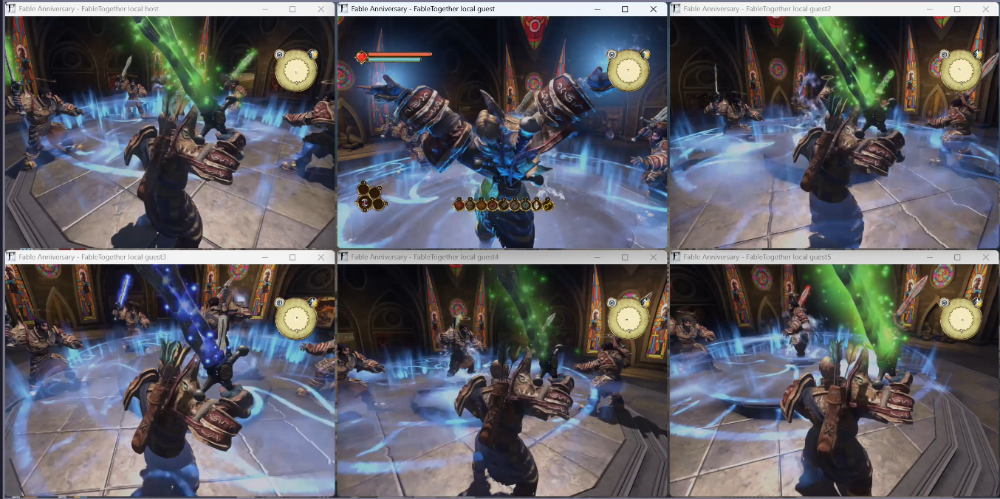

# AlbionTogether — Fable Anniversary Multiplayer Mod

Experimental multiplayer mod for Fable Anniversary.

Join the [AlbionTogether Discord](https://discord.gg/5JSKmjKd85) for playtests, updates, and support.



## Current alpha

One host can accept up to 64 guests (65 players total); the current alpha has been manually tested with six players. Players can load their own Heroes, explore Albion independently, and meet up anywhere. Remote Heroes keep their appearance, weapons, combat animations, emotes, and most Will spell effects.

During alpha, expect some jank. Systems are being roughly implemented to make a full multiplayer playthrough possible. Once the full game can be played by two or more people, development will move into beta and focus on polishing the experience toward release.

### Done

- Load your own save character and see each other.
- Walk around Albion independently and meet in any region.
- Hero appearance, clothing, movement, rotation, and locomotion.
- Equipped weapons, including drawing and returning them to the Hero's back.
- Synchronized melee and ranged combat, including bow aiming, projectiles, damage, and hit reactions.
- Player death, resurrection phials, and Guild respawning.
- Synchronized Hero emotes and expression effects.
- NPC presence, position, movement, health, and death.
- NPC ownership when players split across different regions.
- Player health synchronization during combat.
- Stable map transitions and background rendering.
- Reliable character, equipment, action, and NPC synchronization.

### Next

- Shared quests, cutscenes, warps, and world progress.
- Equipment, loot, trading, currency, shops, and property ownership.
- Player names, interaction menus, door/key permissions, and RP tools.
- Proximity voice chat.
- A friendly host/join launcher UI and production networking.
- Slow Time and Raise Dead synchronization (optional; may be omitted).

This is an early development release. Back up ordinary saves before testing.

## Install and play

AlbionTogether currently targets the 32-bit Steam build of Fable Anniversary.

1. Download and extract the release into Fable Anniversary's `Binaries\Win32` folder.
2. Allow the chosen UDP port through the host's firewall. The default is `38171`.
3. Start the host:

   ```powershell
   .\AlbionTogether.Launcher.exe --host --player-id Host
   ```

4. On the other computer, join using the host's IPv4 address:

   ```powershell
   .\AlbionTogether.Launcher.exe --join 192.168.1.10 --player-id Guest
   ```

5. Each player selects the save containing the Hero they want to use.

Use `--port <port>` on both computers to choose a different UDP port.

## Build

Build `AlbionTogether.sln` as `Release | Win32`. Deployable files are written to `bin\Release`.

The project also includes an embedded AngelScript runtime and native scripting APIs for future gameplay mods.

## License

AlbionTogether's original source code is available under the [MIT License](LICENSE).
Components under [`ThirdParty/`](ThirdParty/) retain their respective licenses.
The MIT License only covers code that this project has the right to license.

## Disclaimer

AlbionTogether is an unofficial fan project and is not affiliated with,
authorized, sponsored, or endorsed by Microsoft.

AlbionTogether requires a legally obtained Steam copy of Fable Anniversary
with modding support. It does not distribute Microsoft game files or provide
access to the game itself.

Fable, Fable Anniversary, and all related names, trademarks, characters,
imagery, and game content belong to Microsoft and/or their respective rights
holders. The AlbionTogether license applies only to this project's original
source code and does not grant rights to any Fable or third-party content.
